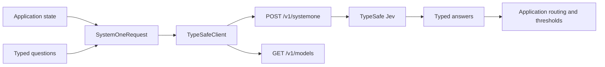
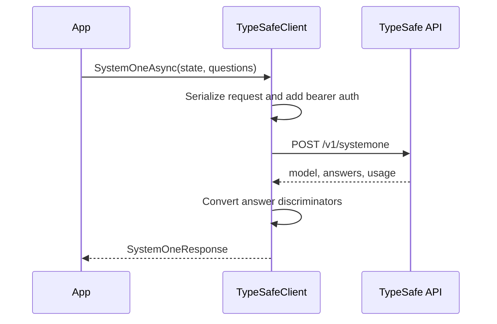

# Architecture

The SDK is a thin typed boundary over the TypeSafe HTTP API. It does not generate prompts or hide decision logic. Your code supplies state and question definitions; the service evaluates each question and returns structured answers.

## Request phase

`SystemOneAsync` validates that state and questions exist, applies the configured model, and serializes the request using `System.Text.Json`.

The request has three important fields:

| Field       | Purpose                                          |
| ----------- | ------------------------------------------------ |
| `state`     | Text, object, or array to evaluate.              |
| `model`     | Model name, `jev-latest` by default.             |
| `questions` | Named `Noul`, `Choice`, and `Score` definitions. |

Question objects are serialized through a discriminator converter so the concrete fields for `criteria` and `instructions` are preserved.

## Transport phase

`TypeSafeClient` uses an injected or internally owned `HttpClient`. It adds `Authorization: Bearer <API_KEY>`, posts JSON to `/v1/systemone`, and supports cancellation tokens on every asynchronous operation.

Transient responses such as `408`, `429`, and `5xx` are retried according to `MaxRetries` and `RetryDelay`. A non-retryable or exhausted response becomes `TypeSafeApiException`, preserving the status code and response body.

## Response phase

Answers are discriminated by their `type` field:

- `noul` becomes `NoulAnswer`.
- `choice` becomes `ChoiceAnswer`.
- `score` becomes `ScoreAnswer`.

`SystemOneResponse` exposes the complete `Answers` map plus filtered `Nouls`, `Choices`, and `Scores` views.

## Data boundaries

The SDK does not persist state, upload files, or perform application routing. It sends the values supplied by the caller to the configured API endpoint and returns the service response. Keep API keys in environment variables or a secret manager rather than source code.
