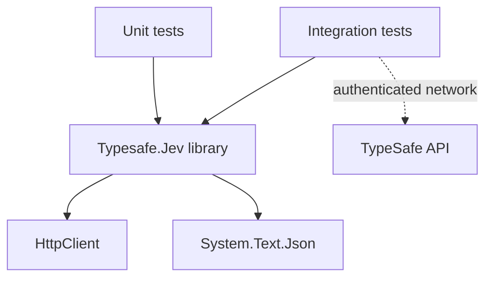

# Development guide

The repository keeps the production library small and separates live API checks from deterministic unit tests.

## Project structure

```text
typesafe-jev-dotnet-sdk/
├── src/
│   ├── Directory.Build.props
│   ├── TypeSafeClient.cs
│   ├── TypesafeModels.cs
│   └── Typesafe.Jev.csproj
├── tests/
│   ├── Directory.Build.props
│   ├── unit-tests/
│   │   ├── TypeSafeClientTests.cs
│   │   └── Typesafe.Jev.UnitTests.csproj
│   └── integration-tests/
│       ├── TypeSafeIntegrationTestBase.cs
│       ├── TypeSafeCoreIntegrationTests.cs
│       └── Typesafe.Jev.IntegrationTests.csproj
├── Directory.Build.props
├── Directory.Packages.props
└── Typesafe.Jev.slnx
```

## Dependency direction



The library does not reference either test project. Unit tests use a stub `HttpMessageHandler`; integration tests construct a real client and call the live service only when credentials are available.

## Build and test

Restore and build the solution:

```bash
dotnet restore
dotnet build Typesafe.Jev.slnx
```

Run unit tests:

```bash
dotnet test --project tests/unit-tests/Typesafe.Jev.UnitTests.csproj
```

Run integration tests:

```bash
dotnet test --project tests/integration-tests/Typesafe.Jev.IntegrationTests.csproj
```

Integration tests use xUnit v3 `SkipUnless` and require `TYPESAFE_API_KEY`. They should never be used as the only validation for serialization or error behavior.

## Adding a feature

1. Add or update public models in `src/TypesafeModels.cs`.
2. Keep wire names explicit with `JsonPropertyName`.
3. Add deterministic HTTP contract coverage under `tests/unit-tests`.
4. Add a live scenario only when it verifies an API behavior that cannot be represented by a stub.
5. Update the API reference and quickstart when the public surface changes.
6. Build the solution and run both test projects before opening a change.
